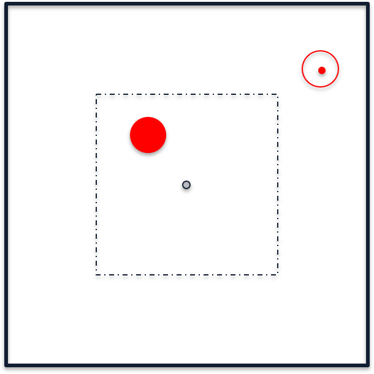

# Push & Slide using HER & DDPG
## Reference paper
**DDPG**: Lillicrap, T. P., Hunt, J. J., Pritzel, A., Heess, N., Erez, T., Tassa, Y., ... & Wierstra, D. (2015). [Continuous control with deep reinforcement learning](https://arxiv.org/pdf/1509.02971.pdf). arXiv preprint arXiv:1509.02971.  
**HER**: Andrychowicz, M., Wolski, F., Ray, A., Schneider, J., Fong, R., Welinder, P., ... & Zaremba, W. (2017). [Hindsight experience replay](https://arxiv.org/pdf/1707.01495.pdf). In Advances in Neural Information Processing Systems(pp. 5048-5058).  
## Environment
  
On the square table there is a probe which is the agent and a puck. We want to control the porbe to hit the puck, and the puck will slide on this slipper table. We want this puck to slide to the target position.  
THe size of table is 100\*100, and the start position of probe is in at the center of the table, while the puck will randomly start in the center square of size 50\*50. The target for each episode is randomly set in the whole table. If the puck is hit by the probe, it will move and slide in that direction for some distance. If the distance from puck to target point is smaller than 5, it will get reward.

**Action**: 2. The probe can move in x and y in the range of (-10, 10)  
**State**: 4. The x and y of probe and the x and y of puck.  
**Reward**: binary. For each action, if the puck doesn't hit the target, it will get -1. If it is out of table, it will get -1 and end this episode. If it hits the target, it will get 0 and end.
# To run
Run `python3 main.py` with some hyperparameter(for more information in the end of main.py), after the training it will output 2 plots. One is for the average reward of 50 episodes(which is called a cycle), another is for the accumulated times of success for a cycle. The higher reward means this episode ends in advance, the higher success time means how many times the puck hits target(other times it may drop from table).
# Future work
..* sdf
* dsf
